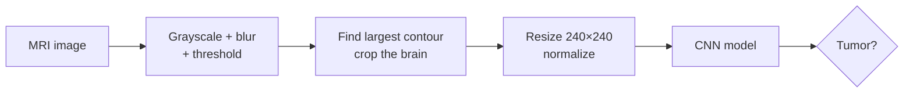

<div align="center">

# 🧠 Brain Tumor Detection

**Detect brain tumors in MRI scans with a CNN, served through a Django web app with user and admin roles.**


</div>

---

## 📖 Overview

The project classifies MRI brain scans as **tumor / no tumor** using a convolutional neural network. A Django web app wraps it with:

- **User accounts**: register, wait for admin approval, log in, then train the model or run detection.
- **Admin panel**: view registered users and activate their accounts (admins log in with a Django superuser account).
- **Detection tool**: pick an MRI image and either get a tumor prediction or highlight the tumor region.

---

## ✨ Features

| | Feature | Details |
|---|---|---|
| 🔍 | **Tumor prediction** | Pre-trained Keras model (`brain_tumor_detector.h5`) predicts whether an MRI contains a tumor |
| 🎯 | **Tumor region view** | OpenCV thresholding + morphology to highlight the tumor area |
| 🏋️ | **Train from the app** | Train a fresh CNN on the dataset and view accuracy/loss curves |
| 👥 | **Role-based access** | Users register; an admin activates accounts before they can log in |

---

## 🔄 How it works



**Preprocessing:** each scan is cropped to the brain using its extreme contour points, which removes the black background so the model focuses on brain tissue.

**Training model** (`users/AlgoProcess/modelTraining.py`): a Keras CNN with four convolution blocks (32 → 64 → 128 → 512 filters, batch norm, max-pooling, dropout, L2 regularization), dense layers of 256 and 512 units, and a 2-class softmax output. It's trained for 25 epochs with Adam on augmented 48×48 grayscale images.

---

## 🚀 Getting Started

### 1. Clone and install

```bash
git clone https://github.com/gmgowrish/Brain-Tumor-Deteciton.git
cd Brain-Tumor-Deteciton

python -m venv venv
source venv/bin/activate        # Windows: venv\Scripts\activate
pip install -r requirements.txt
```

> Requirements are pinned to **TensorFlow 2.10**, so use **Python 3.10** or older.

### 2. Set up the database and an admin account

```bash
python manage.py migrate
python manage.py createsuperuser     # this account logs in on the Admin page
```

### 3. (Optional) get the dataset for training

Training needs the MRI dataset in `media/brain_tumor_dataset/` (`train/` and `test/` folders). Download it from [Google Drive](https://drive.google.com/drive/folders/15143k_rNbUW0defCdWeL-ByRT9fGtEGj?usp=drive_link). Detection works without it, using the included pre-trained model.

### 4. Run

```bash
python manage.py runserver
```

Open **http://127.0.0.1:8000/**.

### 5. Use it

1. **Register** a user account.
2. Log in on the **Admin** page with your superuser account, open **Registered Users** and **activate** the account.
3. Log in as the user and use **Detect** or **Training**.

> The detection tool opens a **desktop (Tkinter) window**, so run the app on your own computer, not a remote server.

---

## 📁 Project Structure

```
Brain-Tumor-Deteciton/
├── BrainTumorDetection/     # Django settings, URLs, main views
├── admins/                  # admin login, user activation
├── users/
│   ├── AlgoProcess/
│   │   ├── brain_tumor_detector.h5   # pre-trained model
│   │   ├── predictTumor.py           # crop + predict
│   │   ├── displayTumor.py           # tumor region highlighting
│   │   ├── modelTraining.py          # CNN training
│   │   └── frames.py                 # Tkinter UI frames
│   ├── forms.py, models.py, views.py
├── templates/               # pages (login, register, home, training)
├── requirements.txt
└── manage.py
```

## 🛠️ Tech Stack

**Python** · **Django** · **TensorFlow / Keras** · **OpenCV** · **imutils** · **Tkinter** · **Matplotlib / Seaborn** · **SQLite**

---

## ⚠️ Disclaimer

This is an academic project and **not a medical device**. Predictions must not be used for diagnosis.

---

<div align="center">

Made by **[G M Gowrish](https://github.com/gmgowrish)** · ⭐ Star the repo if you find it useful!

</div>
